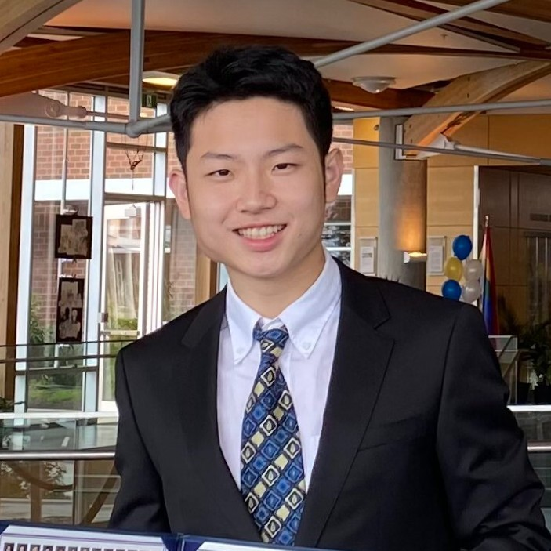

# Jun Yu Chen

 <!-- Update this with the actual path to your image -->

👋 Hi, I'm a Junior student at UCLA majoring in Data Theory and Cognitive Science. My Research interests are in the areas of reinforcement learning and multi-modal models. 

Currently, I am a machine learning student researcher at the Visual Intelligence Lab within the Center for Vision, Cognition, Learning, and Autonomy, under the guidance of Dr. Tao Gao. I am also a research intern at the Ahmet Arac Lab in the Neurology Department. My research projects span a diverse range of topics, from using inverse reinforcement learning to decode skilled mouse movements, to diagnosing glaucoma with generative models, to developing multi-agent reinforcement learning strategies for simulation games.

📊 Beyond my research endeavors, I am passionate about innovation. I co-founded Jobs Jr., a startup aimed at transforming the job discovery process for college students. At Bruin Sports Analytics, I have authored prominent research articles, including predicting NBA champions with 90% accuracy and developing a recommendation system for League of Legends players.

🔍 I am actively seeking internship opportunities and collaborations at the intersection of data science, machine learning, and various sectors including life sciences, business, and entertainment. I am keen to connect with like-minded professionals and contribute to a world influenced by both natural intelligence and AI-driven solutions. Feel free to reach out and connect!

## News

- **Mar 22, 2023** - 
- **Jan 21, 2023** - 

## Selected Publications

[Abstract](#) | [Bib](#) | [PDF](#) | [Code](#) | [Poster](#) | [Website](#)

## Contact

10633 Eastborne Ave,  
Los Angeles, CA 90024  
[LinkedIn]([https://www.linkedin.com](https://www.linkedin.com/in/jun-yu-chen-798718221/))  
[Email](jochen030327@g.ucla.edu)  
